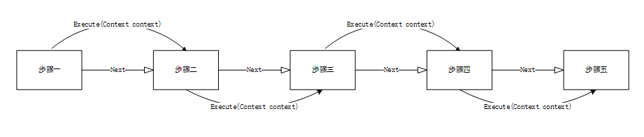

**注** 摘自《Java 高并发编程详解: 多线程与架构设计》 机械工业出版社 汪文君著
# 什么是上下文
上下文是贯穿整个系统或阶段生命周期的对象，其中包含了系统全局的一些信息，比如登录之后的用户信息、账户信息，以及在程序每一个阶段运行时的数据。

在设计系统上下文时，除了要考虑它的全局唯一性之外，还要考虑到有些成员只能初始化一次，比如配置信息的加载，以及多线程环境下，上下文成员的线程安全性。
# 线程上下文设计
在有些时候，单个线程执行的任务步骤会非常多，后一个步骤的输入有可能是前一个步骤的输出，比如在单个线程多步骤执行时，为了使得功能单一，有时候我们会采用GoF 职责链设计模式。



当方法参数较多时，参数的传递会比较繁琐，此时可以尝试采用线程的上下文设计来解决这样的问题。
```java
private ConcurrentHashMap<Thread, ActionContext> contexts = new ConcurrentHashMap<>();

public ActionContext getActionContext() {
	ActionContext actionContext = contexts.get(Thread.currentThread());
	if(actionContext == null) {
		actionContext = new ActionContext();
		contexts.put(Thread.currentThread(), actionContext);
	}
	return actionContext;
}
```
**注** 通过这种方法定义线程上下文很可能会导致内存泄漏，contexts 是一个 Map 的数据结构，用当前线程做 key，当线程的生命周期结束后，contexts中的Thread 实例不会被释放，与之对应的 Value 也不会释放，时间长了就会导致内存的泄漏。可以通过 soft reference 或者 weak reference等引用，JVM 会主动尝试回收。
# ThreadLocal 一般使用场景
在进行对象跨层传递的时候，可以考虑 ThreadLocal，避免方法的多次传递，打破层次间的约束。

线程间数据隔离。

进行事务操作，用于存储线程事务信息。

**注** ThreadLocal 并不是解决多线程下共享资源的技术，若多线程的 ThreadLocal 存储了一个对象的引用，那么其还将面临资源竞争、数据不一致等并发问题。
